# Task Manager API

A task manager API built with .NET Core and a React frontend, where each user owns and manages only their own tasks.

## Design decisions & assumptions

The initial sketch was: API Gateway → Okta → Kafka → Redis → Postgres microservices — an API Gateway routing to microservices, Okta for identity, Kafka for messaging, Redis for caching, and Postgres for storage. That setup is great for high production traffic, but for this task it's scoped down to avoid paying for three extra infrastructure pieces before they provide any actual value.

### Assumptions made

- **Data isolation:** "Each user manages their own tasks." The application enforces this directly at the repository layer. Every single query is filtered by `userId`, meaning a user physically cannot read, edit, or delete another person's data, even if they try to hit the endpoints directly.
- **Authentication:** Not using identity providers like Okta or Auth0, in favor of a standard username/password flow that issues JWTs. It keeps local development fast. If we want to use a third-party auth provider later, it's a quick configuration change in `AddJwtBearer` rather than a codebase rewrite, because the business logic only cares about validating the token.
- **Database:** Defaults to SQLite for local development. Not required to install or run a separate database server to get the project spinning. Since everything runs through Entity Framework Core migrations, swapping this out for Postgres down the road is a connection-string change, not a rewrite.
- **Soft deletes:** an `IsDeleted` flag is used to avoid deleting a task accidentally.

## Architecture

Simple and loosely coupled layered architecture:

```
Controller (HTTP handling) → Service (Business Logic) → Repository (Data access) → EF Core
```

Each layer talks to the one below it through interfaces and only knows about the one directly below it, so any layer can be swapped or mocked independently.

**Figure 1 — Layered request flow**
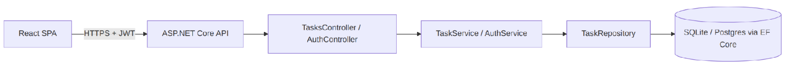
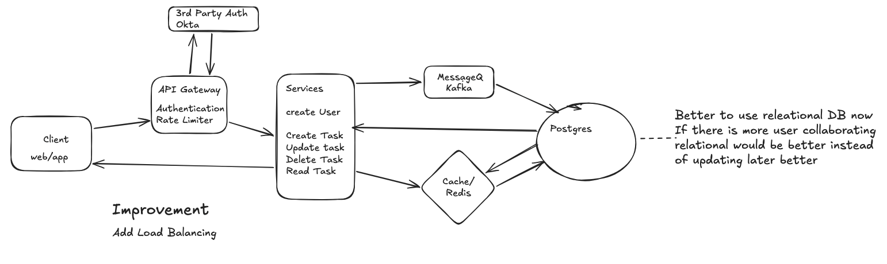

**Figure 2 — Domain model and layer interfaces**
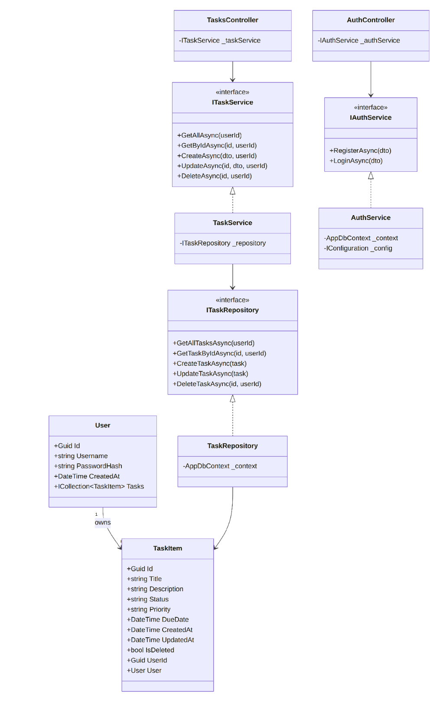

**Figure 3 — Login, then an authenticated task creation**
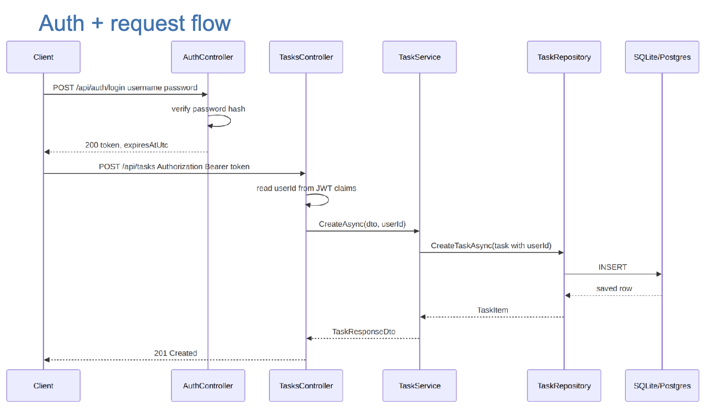

## Setup

**Prerequisites:** .NET 9 SDK, Node 18+

```bash
# Backend
cd TaskApi
dotnet ef database update   # applies migrations (or runs automatically on startup)
dotnet run                  # starts on http://localhost:5153
```

```bash
# Frontend
cd taskapi-client
npm install
npm run dev                 # starts on http://localhost:5173
```

## API reference

| Method | Route              | Auth | Body                                        | Description                        |
|--------|---------------------|------|----------------------------------------------|-------------------------------------|
| POST   | `/api/auth/register` | No   | `{ username, password }`                     | Create an account, returns JWT      |
| POST   | `/api/auth/login`    | No   | `{ username, password }`                     | Returns JWT                         |
| GET    | `/api/tasks`         | Yes  | —                                             | List the caller's tasks             |
| GET    | `/api/tasks/{id}`    | Yes  | —                                             | Get one task (must be owned by caller) |
| POST   | `/api/tasks`         | Yes  | `{ title, description?, priority?, dueDate? }` | Create a task                       |
| PUT    | `/api/tasks/{id}`    | Yes  | any subset above + `status`                   | Partial update                      |
| DELETE | `/api/tasks/{id}`    | Yes  | —                                             | Soft-delete a task                  |

**Example:**

```bash
TOKEN=$(curl -s -X POST http://localhost:5153/api/auth/register \
  -H "Content-Type: application/json" \
  -d '{"username":"alice","password":"correct-horse-battery"}' | jq -r .token)

curl -X POST http://localhost:5153/api/tasks \
  -H "Content-Type: application/json" \
  -H "Authorization: Bearer $TOKEN" \
  -d '{"title":"Ship the README","priority":"High"}'
```

Any request to `/api/tasks/*` without a valid `Authorization: Bearer <token>` header returns `401`. A task ID that exists but belongs to another user returns `404` (not `403`), this avoids confirming to an attacker that a given task ID even exists.


### Testing through Postman

1. **Register** — Expected: `200 OK`
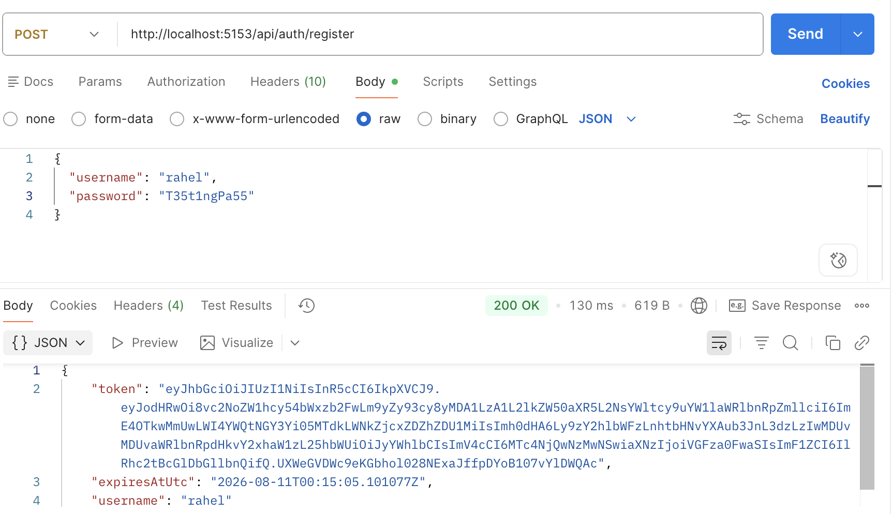

2. **Register with the same username again** — Expected: `409 Conflict`, "Username is already taken"
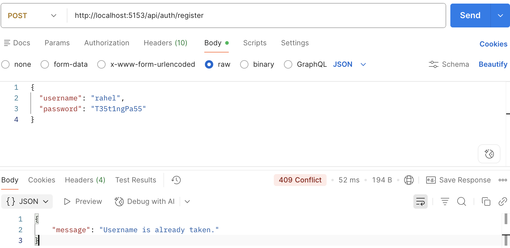
3. **Login with correct username and password** — Expected: `200 OK`
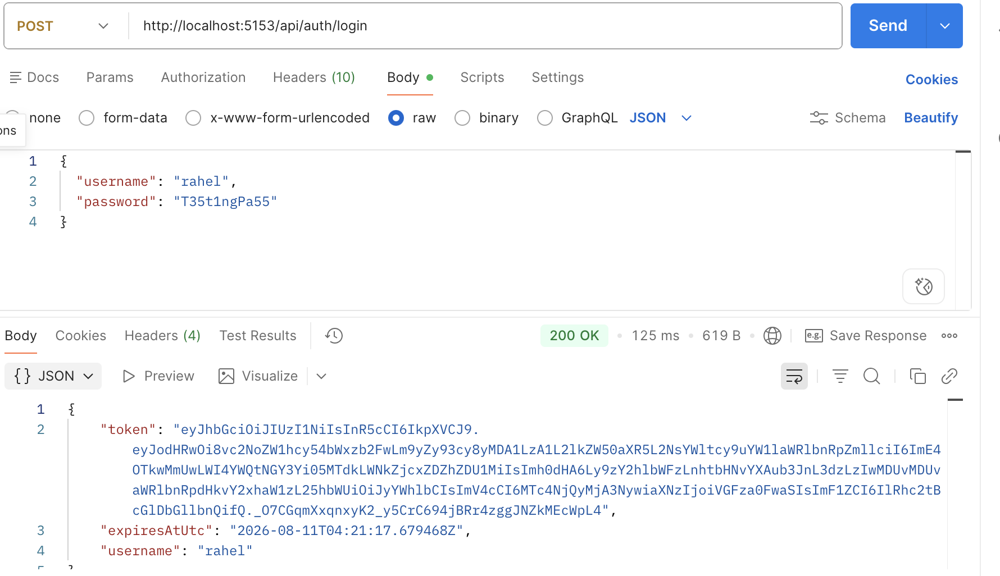
4. **Login with incorrect username or password** — Expected: `401 Unauthorized`
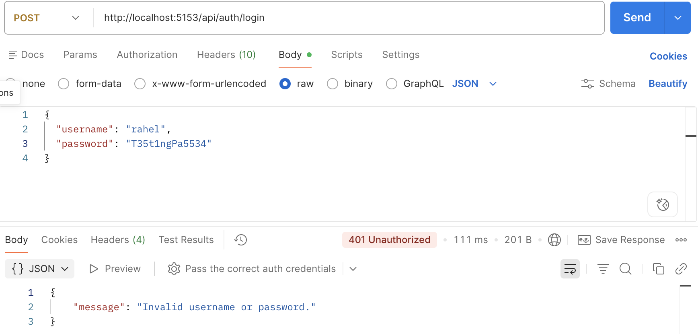
5. **Get tasks without a token** — Expected: `401 Unauthorized`
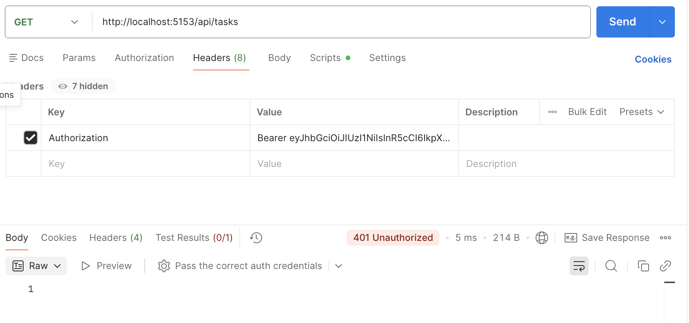
6. **Get tasks with a token** — Expected: `200 OK`, `[]`
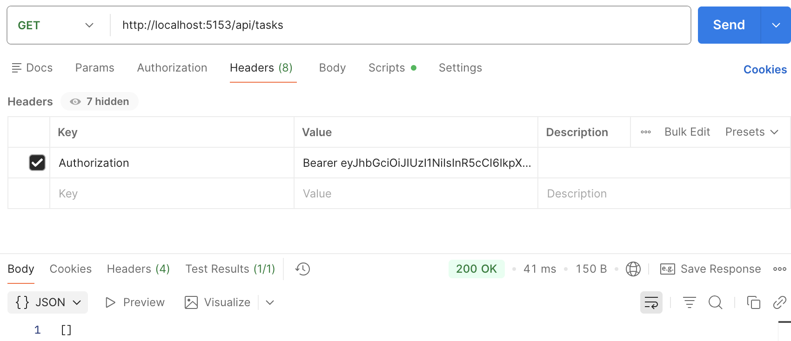
7. **Create a task with a token** — Expected: `201 Created`, response contains task details including `id`
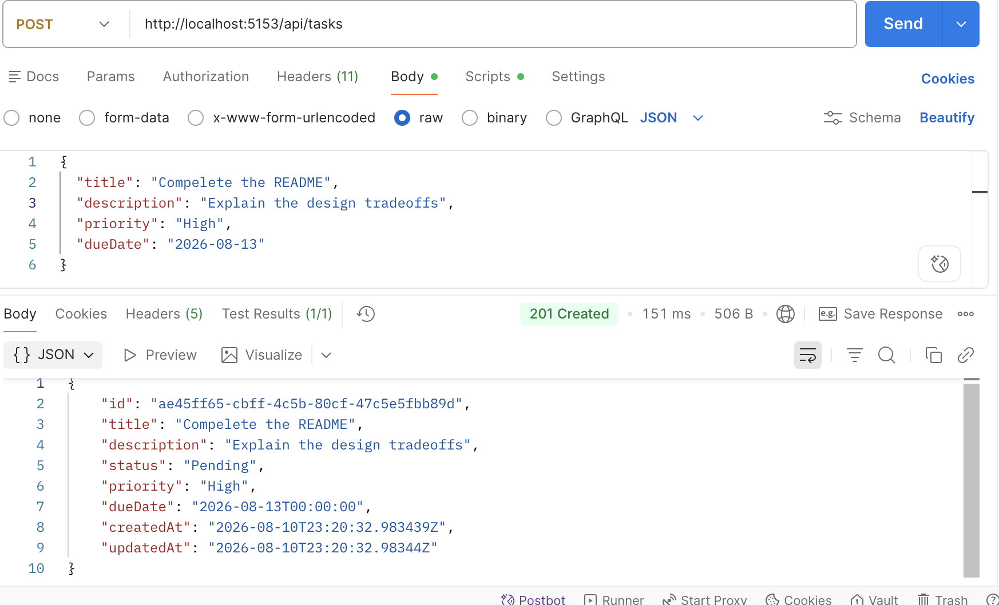
8. **Update a task by ID** — Expected: `200 OK`, updates status to `InProgress`
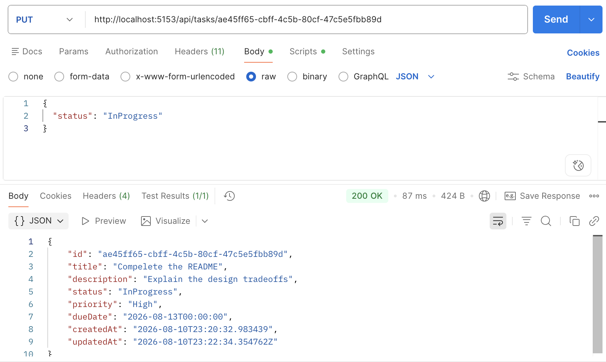
9. **Delete a task by ID** — Expected: `204 No Content`
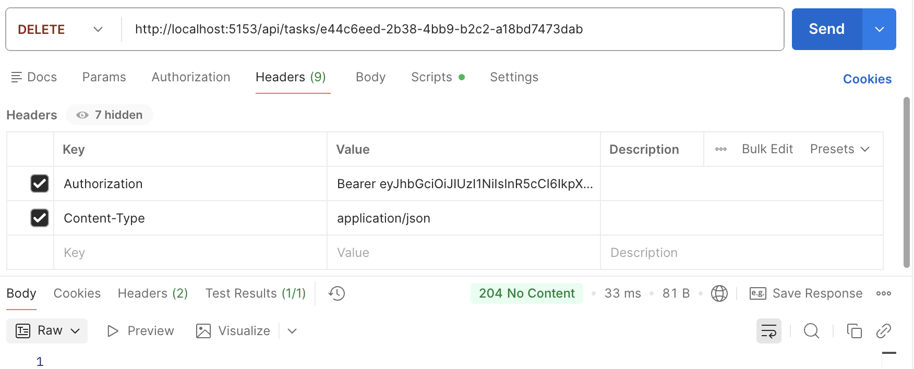

Trying to update or delete a task that isn't yours returns `404 Not Found` (not `403`), that way the ownership check does not let you confirm whether the task exists at all.

If a token expires, log in again to get a new one.

## UI

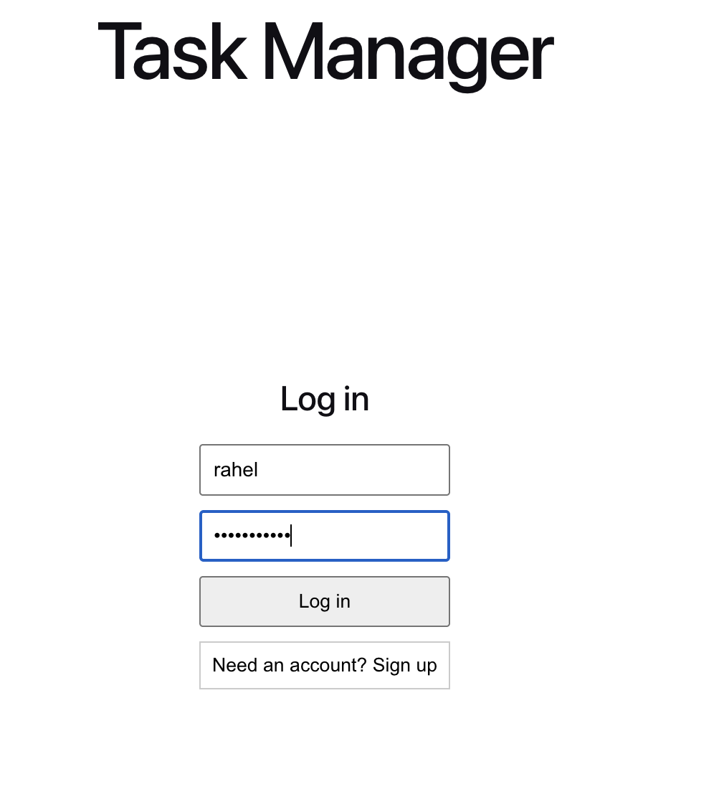
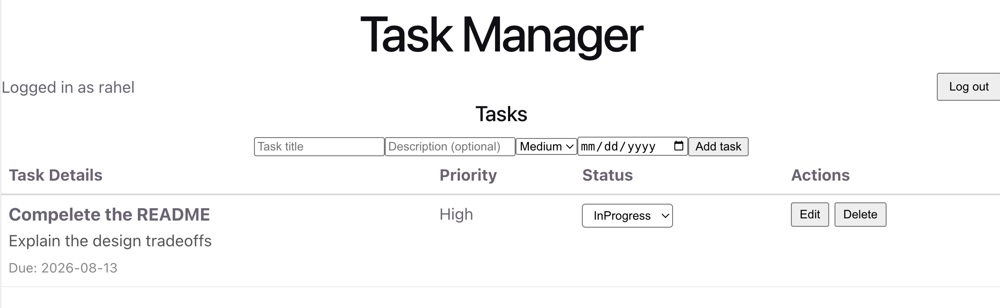


## Future scaling backlog

- **Rate limiting:** implement .NET's built-in rate limiter middleware. Since this runs in-process, no need to stand up a Redis instance yet for a single-instance API.
- **Refresh tokens:** add refresh tokens to the auth flow so access tokens can be short-lived (e.g., 15 minutes) without disrupting the user experience.
- **Production database migration:** swap the local SQLite instance for Postgres or SQL Server by updating the connection string and applying the existing EF Core migrations.
- **Distributed caching:** introduce Redis in front of the repository layer to cache frequently accessed task lists and reduce direct database read pressure.
- **Asynchronous processing:** integrate Kafka or RabbitMQ to offload heavy background jobs (like sending daily task summary emails or processing analytics) away from the main HTTP request-response cycle.
- **Managed identity:** offload user management, password hashing, and OAuth/MFA flows to a dedicated provider like Okta or Auth0.
- **Move JWT to an httpOnly cookie:** keeps the token completely invisible to JavaScript, meaning an attacker can't steal it even if they find an XSS vulnerability.
- **More features:** sub-tasks, deadlines/reminders, notifications, file attachments, multiple people contributing to a task, assigning a task to someone.
- **Pagination:** on `GET /api/tasks` once task counts grow past a page or two.
- **Integration tests:** add more coverage, including `WebApplicationFactory` + in-memory SQLite to test the full HTTP pipeline, not just service-layer logic.
